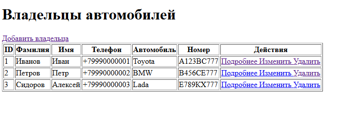
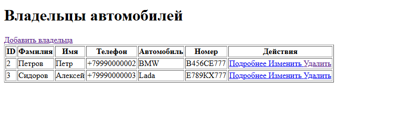
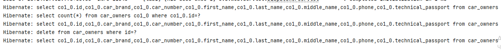
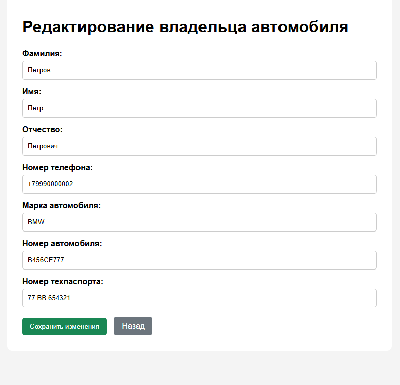
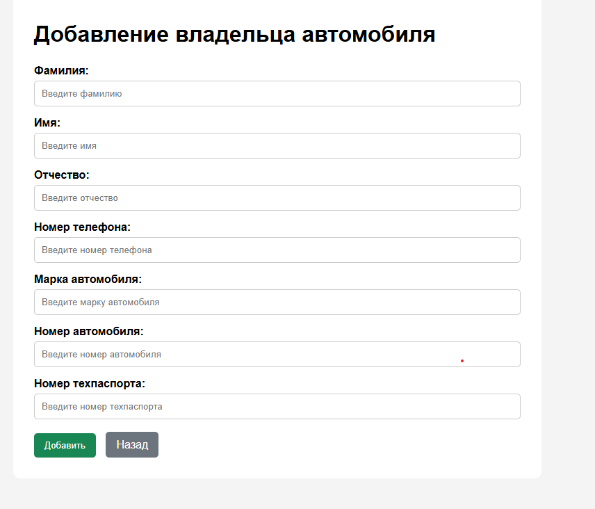

## Цель работы
Изучить способ использования репозитория в Spring Data JPA. Реализовать страницы для хранения и управления информацией о владельцах автомобилей с возможностью добавления, просмотра, редактирования и удаления записей.

## Архитектура проекта
- **Стек:** Spring Boot 3, Maven/Gradle
- **СУБД:** H2, PostgreSQL
- **Основные слои:**
  - Controller — обработка HTTP-запросов (MainController)
  - Model / Entity — класс CarOwner, описывающий владельца автомобиля и его данные
  - Repository — интерфейс CarRepository для работы с данными через Spring Data JPA
  - View — HTML-шаблоны Thymeleaf:
    - main.html — список владельцев автомобилей
    - edit.html — добавление и редактирование владельца
    - details.html — подробная информация о владельце
- **Ключевые аннотации:**
- @Controller
- @GetMapping
- @PostMapping
- @PathVariable
- @ModelAttribute 
- @Entity 
- @Table 
- @Id
- @GeneratedValue
- @Column 
- @Autowired 
  
## Алгоритм работы
- Главная страница (/) — GET-запрос получает список владельцев из базы данных и отображает его в шаблоне main.
- Добавление владельца (/add) — GET-запрос отображает форму добавления в шаблоне edit.
- Обработка добавления (POST /add) — принимает данные владельца и сохраняет их через CarRepository.
- Просмотр информации (/details/{id}) — GET-запрос получает владельца по ID и отображает подробную информацию в шаблоне details.
- Редактирование (/update/{id}) — GET-запрос получает данные владельца и отображает заполненную форму в шаблоне edit.
- Сохранение изменений (POST /update) — принимает изменённые данные и сохраняет их в базе данных.
- Удаление (/delete/{id}) — GET-запрос удаляет владельца по ID и возвращает пользователя на главную страницу.

## Скриншот работы приложения
  ### Список владельцев автомобилей
  
  
  ### Удаление владельца автомобиля
  

  ## Результат в консоле
  
  
  ## Редактирование
  

  ## Добавление
  
